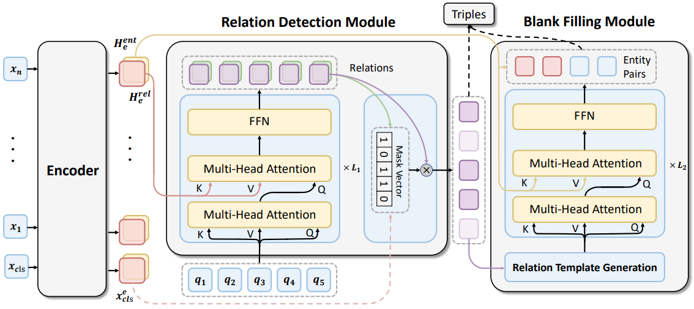

## RFBFN: A Relation-First Blank Filling Network for Joint Entity and Relation Extraction

PyTorch code for RFBFN: A Relation-First Blank Filling Network for Joint Entity and Relation Extraction. For the description of the model and experiments,  please see our paper. The model structure is as follows:



### Requirements

```
Python: 3.5+
PyTorch: 1.7.0
transformers: 4.6.1
allennlp: 0.9.0
numpy: 1.19.2
tqdm: 4.60.0
```

### Datasets

- NYT* and WebNLG* ( following [CasRel](https://github.com/weizhepei/CasRel) )
- NYT ( following [CopyRE](https://github.com/xiangrongzeng/copy_re) )
- WebNLG ( following [ETL-span](https://github.com/yubowen-ph/JointER) )

We provide preprocessed datasets in `./data_preprocess/data/`, you can just download them. 

### Usage

1. Build Data

   For **WebNLG***:

   ```
   cd data_preprocess
   python preprocess.py  
   ```

   For **NYT***:

   ```
   cd data_preprocess
   python preprocess.py --task "nyt" --duplicate_questions 6
   ```

2. Train 

   After preparing the data for RFBFN model, you can train and test the model.

   For **WebNLG***:

   ```
   cd ..
   python RFBFN_main.py --gpu_setting "0" --RE_loss_for_RD_parameter 10 --learning_rate_in_RD 4e-5
   ```

   For **NYT***:

   ```
   cd ..
   python RFBFN_main.py --task "nyt" --num_decoder_layers_for_RD 3 --queries_num_for_RD 15 --no_rel_reweighting_in_RD 0.6 --learning_rate_for_RE_decoder_in_BF 7e-05
   ```

3. Evaluate

   (1) Generate predicted data for Blank Filling Module

   For **WebNLG***:

   ```
   python RFBFN_generate_result.py  --generate_step "1"
   
   cd data_preprocess
   python preprocess.py --log_path "../pred_result/pred_data/" --step "2"
   ```

   For **NYT***:

   ```
   python RFBFN_generate_result.py  --generate_step "1" --task "nyt"
   
   cd data_preprocess
   python preprocess.py --log_path "../pred_result/pred_data/" --step "2"  --task "nyt" --duplicate_questions 6
   ```

   (2) Obtain Performance

   For **WebNLG***:

   ```
   python RFBFN_generate_result.py  --generate_step "2" 
   ```

   For **NYT***:

   ```
   python RFBFN_generate_result.py  --generate_step "2" --task "nyt"
   ```

For **WebNLG** or **NYT**, add another `--star 0` option and run the code similarly. 


